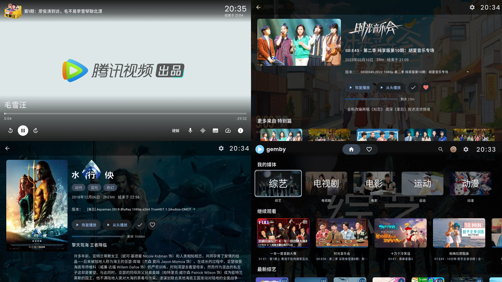

  </img>

<h1 align="center">gemby</h1>

  </img>
  <a href="https://github.com/AmbitiousJun/gemby/releases/latest"></img></a>
  </img>

  一个基于 MPV 内核的简约 Emby AndroidTV 客户端

## 界面展示

  </img>

## 交流群

- QQ: `1040749206`

## 使用说明

1. 目前只适配 AndroidTV，欢迎 issue 区反馈问题，佛系更新～
2. 播放接口基于 [go-emby2openlist](https://github.com/AmbitiousJun/go-emby2openlist) 进行开发，可能对 Emby 原生播放功能适配不是特别好

## 请我喝杯 9.9💰 的 Luckin Coffee☕️

</img>

## Star History

<a href="https://star-history.com/#AmbitiousJun/gemby&Date">

 <picture>
   <source media="(prefers-color-scheme: dark)" srcset="https://api.star-history.com/svg?repos=AmbitiousJun/gemby&type=Date&theme=dark" />
   <source media="(prefers-color-scheme: light)" srcset="https://api.star-history.com/svg?repos=AmbitiousJun/gemby&type=Date" />
   
 </picture>

</a>
